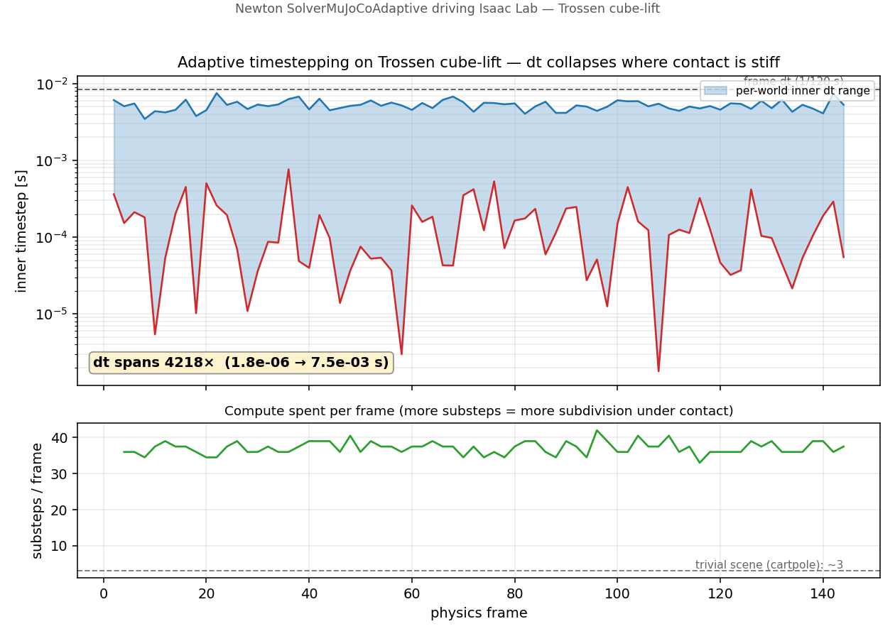

# isaac-rubato

**An adaptive-physics platform for robotics reinforcement learning.**

Built on Isaac Sim, Isaac Lab, and Newton — with adaptive timestepping as a first-class, selectable
solver, and a clean path toward convex contact integration (CENIC).

!!! quote "Rubato"
    *Rubato* (It., "stolen") — the flexible variation of local tempo in musical performance: time taken
    from some beats and repaid in others. Here it names **adaptive timestepping**: integration effort is
    reallocated across a frame — spent on stiff-contact intervals, withheld from free motion — while the
    frame boundary is kept fixed.

---

## What it is

A single platform where the physics integrator is a **selectable solver**, not a fixed assumption. You
author a scene in the interactive editor, train a policy in Isaac Lab, and choose the backend — PhysX,
stock Newton, or the adaptive Newton solver — without touching the layers above the integrator.

-   :material-engine-outline: **Adaptive physics, built in**

    `SolverMuJoCoAdaptive` runs as a drop-in solver mode of Isaac Lab's Newton backend —
    error-controlled step-doubling that subdivides `dt` where contact is stiff.

-   :material-cube-outline: **Interactive editor**

    `rubato` opens the Isaac Sim editor on the Newton backend — drop an object, press Play, watch it
    fall on Newton. Author scenes, not config files.

-   :material-sitemap-outline: **One small seam**

    The whole integration is two methods in one class. Everything above the integrator — policy,
    rewards, observations, rendering — is unchanged.

-   :material-map-marker-path: **A road to CENIC**

    Adaptive timestepping today; convex contact integration (ICF / SAP) next — the PI's full method,
    through the same seam.

---

## The result

On the Trossen cube-lift (a contact-rich manipulation task), the adaptive solver reallocates integration
effort exactly where it's needed:

- inner `dt` spans **4218×** — `1.8e-6 s` at grasp/table contact, relaxing to `7.5e-3 s` in free motion
- **~37 substeps/frame** under contact, versus **~3** on a dynamically trivial scene
- PhysX, stock-Newton, and adaptive all run the task cleanly; the PhysX baseline is unregressed

---

## The idea

A fixed substep is one compromise applied to a whole frame. Coarse enough to be efficient in free
motion, it under-resolves stiff contact — integration error, penetration, instability. Fine enough to
resolve contact, it over-resolves everything else and wastes computation. **Contact-rich manipulation is
exactly where that compromise is worst**, and exactly where simulation fidelity matters most for
sample-efficient RL.

Two error sources are separable: the **temporal** one (the integrator's step vs. the local stiffness)
and the **contact-model** one (non-convex, iterative contact solvers). Adaptive timestepping controls
the first; convex contact integration controls the second. CENIC is both.

[Architecture →](architecture.md){ .md-button .md-button--primary }
[Roadmap →](roadmap.md){ .md-button }

---

## At a glance

| | Status |
|---|---|
| Newton physics in the interactive editor | :material-check: working (`rubato`) |
| Adaptive solver in Isaac Lab training | :material-check: integrated and measured |
| Adaptive solver in the editor (GUI) | :material-progress-clock: next (config-driven, same solver) |
| Convex contact (ICF / SAP) — the rest of CENIC | :material-progress-clock: planned, same seam |
