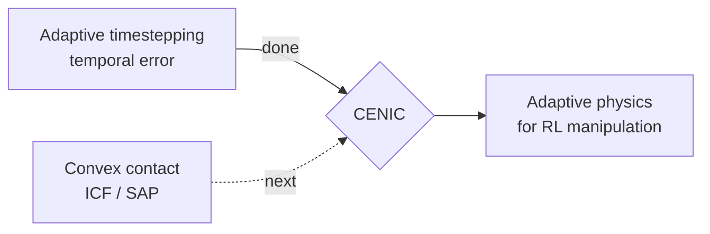

# Roadmap

The platform exists to carry one idea end to end: **adaptive physics as the integrator for RL**. The
near-term work unifies that across the editor and training paths; the research target is CENIC.

## Where things stand

| Milestone | State |
|---|---|
| Adaptive solver integrated into Isaac Lab's Newton backend | **done** |
| Adaptive solver measured on a contact-rich task (Trossen) | **done** — dt spans 4218×, ~37 substeps/frame |
| Newton physics in the interactive editor | **done** — `rubato` |
| Adaptive solver selectable **in the editor** | **next** |
| Convex contact integration (ICF / SAP) — the rest of CENIC | **planned** |
| Second and third scenes (Unitree G1, Leap hand) | **planned** |

## Next: adaptive in the editor

Adaptive timestepping is proven in the training path. The editor currently runs **stock** Newton. The
unification is config-driven: the editor's Newton path selects `SolverMuJoCoAdaptive` through the same
`/isaaclab/newton/adaptive` switch, so the editor can author and play a scene on the adaptive solver
directly — "Newton (adaptive)" live in the viewer, not just in training telemetry.

## Then: convex contact — true CENIC

CENIC is adaptive timestepping **plus** convex contact integration (ICF / SAP). The adaptive half
controls temporal error; the convex half controls the contact-model error that non-convex, iterative
solvers introduce. The integration seam is the same shape: the contact model is swapped at solver
construction, and the layers above the integrator stay invariant.

## Then: more scenes

The Trossen cube-lift is one contact-rich task. A Unitree G1 (locomotion) and a Leap hand (dexterous
manipulation) broaden the regimes the integrator is measured on and define what belongs in the shared
`rl/` layer versus a scene.

## Why this order

Prove the temporal half on a real task first (done), make it usable interactively (in progress), then
add the contact half on the same seam. Each step is measurable on the same platform, against the same
task, with the layers above the integrator untouched.
